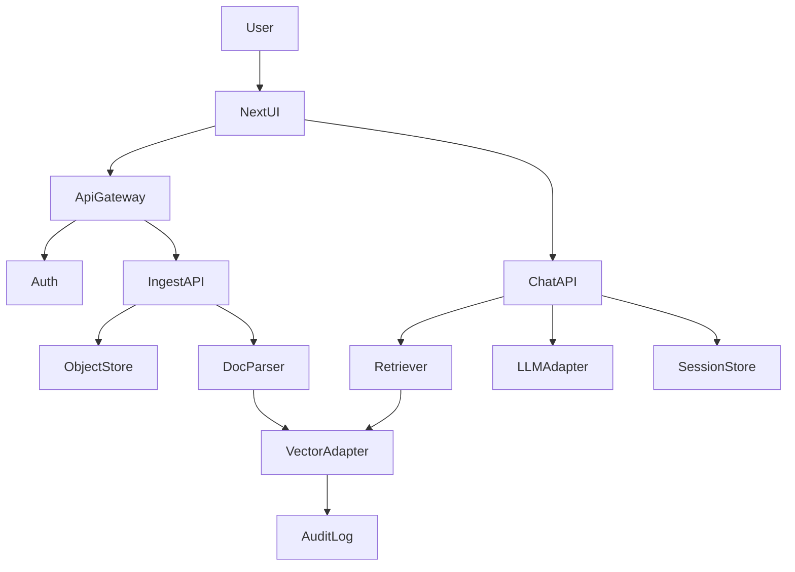
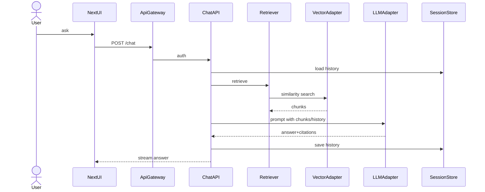

# Design Document

## Overview
PDFをナレッジ化しRAGで回答するAI司書を提供する。学習コストの低いモダンスタックで、アップロードから出典付き回答までを一貫して扱う。既存システムへの影響は限定的なグリーンフィールド実装。

### Goals
- PDF取り込み・ベクトル化を安全に完了 (Req 1.x, 2.x)
- 質問に出典付き回答を返す (Req 3.x)
- テナント隔離と認可を徹底 (Req 4.x)
- UXと可観測性を備える (Req 5.x)

### Non-Goals
- OCR対応（画像PDF）
- マルチリージョン冗長
- モバイルネイティブアプリ

## Architecture

### Architecture Pattern & Boundary Map
Hexagonal。UI/LLM/Vectorをポート経由で接続し、DocumentとQAドメインをコアに保持。ストレージ/ベクトル/認証はSupabaseに統合。RLSでtenant境界を強制。



### Technology Stack
| Layer | Choice / Version | Role | Notes |
|-------|------------------|------|-------|
| Frontend | Next.js 15 (React 19) + Tailwind + shadcn/ui + react-markdown | UI/アップロード/チャット | Server Actions + ストリーミング、認証UIはSupabase Auth連携 |
| Backend | FastAPI 0.115, Uvicorn, LangChain 1.0, Pydantic v2, CORSMiddleware, python-dotenv, Supabase Auth JWT検証 | API/認証/取り込み/QA | Supabase発行JWTを検証、型安全API、CORS許可 |
| AI | OpenAI gpt-4o-mini / text-embedding-3-small | 生成・埋め込み | 設定でモデル切替可 |
| Data | Supabase Storage (原本), Supabase Auth, Supabase PostgreSQL + pgvector (メタ/ベクトル), Supabase Postgres/kv (セッション) | 永続ストアをSupabaseに集約 | VectorStoreはpgvector、StorageにPDF、AuthもSupabaseに一本化 |
| Messaging | 内部キュー（将来） | 重い再インデックス用 | 初期は同期 |
| Tooling | Biome, Ruff, Mypy | Lint/型検査 | CIで両言語検証 |
| Infra | Docker Compose (dev), Supabase (DB/Storage/Auth), Vercel(Frontend), Render(Backend) | Dev/CI/Deploy | TLS終端は各PaaS。環境変数はSupabase/Vercel/Renderで管理 |

## System Flows
### 文書取り込み
```mermaid
sequenceDiagram
    actor User
    participant UI as NextUI
    participant API as ApiGateway
    participant ING as IngestAPI
    participant PAR as DocParser
    participant VEC as VectorAdapter
    participant OBJ as ObjectStore
    User->>UI: upload PDF
    UI->>API: POST /upload
    API->>ING: auth + validate
    ING->>OBJ: store file
    ING->>PAR: extract text
    PAR->>VEC: chunk+embed
    VEC-->>ING: index ids
    ING-->>UI: success(docId)
```

### 質問応答


## Requirements Traceability
| Requirement | Components | Interfaces/Flows |
|-------------|------------|------------------|
| 1.1-1.5 | NextUI, ApiGateway, IngestAPI, DocParser | /upload, 文書取り込み |
| 2.1-2.5 | DocParser, VectorAdapter | VectorIndexPort, 文書取り込み |
| 3.1-3.5 | NextUI, ApiGateway, ChatAPI, Retriever, LLMAdapter, SessionStore | /chat, 質問応答 |
| 4.1-4.5 | ApiGateway, Auth, VectorAdapter, SessionStore | auth middleware, tenantスコープ |
| 5.1-5.5 | NextUI, Observability | UI states, metrics/logs |

## Components and Interfaces
(概要表で全体を網羅し、主要コンポーネントのみ詳細を記述)

### 概要表
| Component | Layer | Intent | Req | Dependencies (P0) | Contracts |
|-----------|-------|--------|-----|--------------------|-----------|
| NextUI | UI | アップロード/チャット表示 | 1.x,3.x,5.x | ApiGateway | API |
| ApiGateway | Backend | 認証・入力検証・ルーティング | 1-5 | Supabase Auth JWT Verify, IngestAPI, ChatAPI | API |
| IngestAPI | Backend | PDF永続化・抽出・インデックス | 1.x,2.x | ObjectStore, DocParser, VectorAdapter | Service/Batch |
| DocParser | Backend | 抽出・チャンク化 | 1.2,2.1 | pypdf | Service |
| VectorAdapter (VectorIndexPort) | Backend | 埋め込み登録/検索/削除 | 2.x,3.1,3.3 | pgvector (Supabase) | Service |
| ChatAPI/ChatService | Backend | 質問処理・履歴管理 | 3.x,5.1 | Retriever, LLMAdapter, SessionStore | Service/API/State |
| Retriever | Backend | top-k取得 | 3.1 | VectorAdapter | Service |
| LLMAdapter | Backend | LLM呼び出し | 3.1-3.3 | OpenAI | Service |
| SessionStore | Data | 履歴保存 | 3.5 | Supabase Postgres/kv | State |
| Observability | Support | メトリクス/アラート | 5.x | OTel exporter | Event |

### 詳細コンポーネント（要点のみ）
- **ApiGateway** — Supabase Auth JWT認証（Bearer）。JWKs: `https://<project>.supabase.co/auth/v1/jwks` をキャッシュ（TTL例:10分）、alg=RS256、aud/iss=`https://<project>.supabase.co` を環境ごとに設定。exp/nbfチェック、clock skew±2分許容。**tenant_idは必須custom claim `tenant_id` とし、未設定なら401**。リクエスト冒頭で`SET app.tenant_id`に反映。/upload・/chatにサイズ/レート制御。CORSでlocalhost:3000/5173許可。Errors: 400/401/413/429/500。
- **DocumentIngestionService** — 前提: PDF<=50MB & MIME=pdf。保存→抽出→embed→indexを同期実行（後でキュー化）。docId再処理は置換。Supabase Storageバケット `tenant-{id}` に `docs/{docId}` で保存し、バケットポリシーはauthロールのみ許可かつJWTのtenant_idとバケットtenant一致を強制。署名付きURLはデフォルト禁止、必要時のみ有効期限付き発行。
- **DocParser** — pypdf + RecursiveCharacterTextSplitter。chunkサイズとオーバーラップは設定値。画像PDFはエラーを上位へ伝搬。
- **VectorIndexPort** — `upsert(tenant, docId, chunks)`, `query(tenant, q, top_k)`, `delete(tenant, docId)`。pgvector(Supabase)実装。top_k上限とtenant分離をバリデート。RLSでtenant_id一致を強制し、APIで`SET app.tenant_id` を実行。再インデックスは単一トランザクションで「既存doc行削除→chunks upsert（ON CONFLICT DO UPDATE）」を完了し、失敗時はロールバックしてdocuments/ingest_jobsをerrorに更新。削除はdoc_idスコープで全ベクトルを削除。
- **ChatService** — `answer(question, sessionId?, tenant, doc_scope?)`→Retriever→LLMAdapter。react-markdown描画を想定し、回答+citationsをストリーム返却。sessionId無指定なら新規発行し、Supabase Postgres/kvへ保存しSupabase Authユーザーと関連付け。
- **LLMAdapter** — OpenAI SDKでgpt-4o-mini、Embeddingはtext-embedding-3-small。モデル/温度は設定管理。キーはdotenv/KMSで管理。
- **SessionStore** — Supabase Postgres/kvにkey=`tenant:{id}:session:{sid}`で保存、TTL/履歴長（設定例:7日/100メッセージ）を強制。Supabase Authユーザー/セッションとマッピングし、期限切れレコードは週次ジョブでパージ。
- **Observability** — Metrics: ingestion_duration, embedding_throughput, chat_latency。Alert: latency_threshold_exceeded。OTel→Prometheus互換（RenderでエクスポートしGrafana Cloud等で可視化）。ログはシークレットマスク。

## Data Models
- Document(docId, tenantId, filename, status, createdAt)
- ParsedChunk(docId, page, text, hash)
- ScoredChunk(chunkRef, score, citation)
- ChatSession(sessionId, tenantId, messages, updatedAt)
- 物理: Supabase Postgres
  - documents(doc_id PK uuid, tenant_id text, filename text, status text, created_at timestamptz) — RLS: `tenant_id = current_setting('app.tenant_id')`
  - ingest_jobs(doc_id FK, status, error_reason) — RLS同上
  - chat_sessions(session_id uuid PK, tenant_id text, messages jsonb, updated_at timestamptz) — RLS同上，TTL/クリーンアップジョブ対象
  - vectors(id uuid PK, tenant_id text, doc_id text, page int, chunk_hash text, content text, embedding vector(1536)) — RLS同上；UNIQUE(tenant_id, doc_id, chunk_hash)＋ivfflat(embedding)＋btree(tenant_id, doc_id)
- Storage: Supabase Storage バケット `tenant-{id}` 配下に `docs/{docId}`
- サンプル類似検索SQL: `SELECT doc_id, page, content, embedding <-> :query_vec AS score FROM vectors WHERE tenant_id = current_setting('app.tenant_id') ORDER BY score ASC LIMIT :k;`

## Error Handling
- User: 400/401/403/404/413（サイズ）、422（状態競合）
- System: 500、LLM/Vectorタイムアウトはリトライ+サーキットブレーカー
- Strategy: 早期バリデーション、エラー理由をUIに提示、再試行リンク提示

## Testing Strategy
- Unit: DocParser分割、VectorAdapter upsert/query、ChatServiceプロンプト組立
- Integration: /upload→抽出→index、/chat（LLMモック）、テナント分離
- E2E/UI: アップロード成功/失敗、ストリーム表示、エラー再試行
- Performance: 検索レイテンシ、LLM応答タイムアウト、50MB処理時間
- Static Analysis: Biome (TS/JS)、Ruff (lint)、Mypy (型) をCI実行
- Approach: テスト駆動開発(TDD)を原則とし、統合テストカバレッジ80%を目標（閾値未達は警告のみでビルドは通す）。

## Security Considerations
HTTPS必須、Supabase Auth JWT検証（RS256/JWKS、aud/iss検証）。APIキーはdotenv/KMSで管理しログに出さない。ストレージ/DB/ベクトル/セッションをSupabaseで永続化し、tenant_idでスコープを分離しRLSで強制。RBACでupload/chat権限を分離可。

## Performance & Scalability
top_k・max_context_tokensを設定化。Supabase pgvectorでテナント別テーブル(RLS)を運用。IVFFlat初期値: lists=100, probes=10（検証後調整）。将来: ingestion非同期化、LLM呼び出しキャッシュ、マルチリージョンを検討。Supabase無料枠超過時はスロットリング/課金開始のため、容量/転送/クエリ回数をメトリクスで監視し閾値を設定。

## Supporting References
詳細なベンダー設定や比較は research.md を参照。
