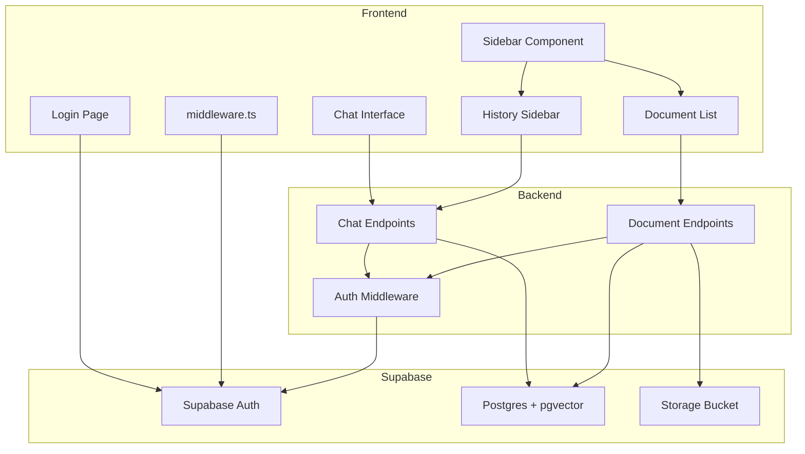

# Technical Design: Production Release

## Overview

AI 司書チャットボットを本番環境（Vercel/Render/Supabase）にデプロイし、Supabase Auth 統合により、ポートフォリオとして公開可能な状態に引き上げる。Phase 1 でデプロイ・認証基盤を完成させ、Phase 2 で ChatGPT 風 UI（履歴・ドキュメント管理・引用リンク）を追加する。

### Goals

- Vercel/Render への本番デプロイ、Supabase Auth 統合（Email/Password + Guest Login）
- ChatGPT 風 UI（shadcn/ui Sidebar）によるチャット履歴・ドキュメント管理
- クリック可能な引用リンク（Signed URL）、モバイル対応

### Non-Goals

- OAuth (Google/GitHub) → Phase 3
- LLM タイトル生成 → コスト削減のため Phase 3
- ドキュメント検索 → MVP 範囲外

## Architecture

### Architecture Pattern & Boundary Map

**Selected Pattern**: Hybrid Approach（Extension + New Components）

- **Phase 1**: Auth infrastructure 新規、Error handling 拡張
- **Phase 2**: History/Document UI 新規、Citation 拡張

**Domain Boundaries**:

- **Auth**: Supabase client + middleware.ts + /login（新規）
- **Chat**: Chat Interface（既存）+ History Sidebar（新規）
- **Document**: Upload Form（既存）+ Document List（新規）



### Technology Stack

| Layer    | Choice                               | Role                 | Notes                    |
| -------- | ------------------------------------ | -------------------- | ------------------------ |
| Frontend | @supabase/supabase-js, @supabase/ssr | Auth client          | New                      |
| Frontend | shadcn/ui Sidebar                    | ChatGPT-style layout | `npx shadcn add sidebar` |
| Frontend | React Context                        | Session state        | SessionContext           |
| Backend  | FastAPI, python-jose                 | JWT verification     | Existing                 |
| Data     | Supabase Auth                        | Email + Anonymous    | Enable in dashboard      |
| Infra    | Vercel, Render                       | Deployment           | New/Existing             |

## Requirements Traceability

| Req     | Components                                             | APIs                                    | Notes                |
| ------- | ------------------------------------------------------ | --------------------------------------- | -------------------- |
| 1.1-1.5 | Vercel config, README                                  | ENV vars                                | NEXT_PUBLIC_API_URL  |
| 2.1-2.7 | Supabase client, middleware.ts, /login, /auth/callback | createBrowserClient, createServerClient | Cookie-based session |
| 3.1-3.5 | useChat (timeout)                                      | AbortController                         | 30s timeout          |
| 4.1-4.8 | HistorySidebar, SessionContext                         | GET/DELETE /sessions                    | Infinite scroll      |
| 5.1-5.7 | DocumentList                                           | GET/DELETE /documents                   | Confirmation modal   |
| 6.1-6.4 | chat-message.tsx                                       | GET /documents/{id}/url                 | Signed URL (1h)      |

## Components and Interfaces

### Component Summary

| Component               | Intent              | Req      | Dependencies               | Contracts    |
| ----------------------- | ------------------- | -------- | -------------------------- | ------------ |
| lib/supabase/client.ts  | Browser client      | 2.1-2.7  | @supabase/supabase-js (P0) | Service      |
| lib/supabase/server.ts  | Server client       | 2.1-2.7  | @supabase/ssr (P0)         | Service      |
| middleware.ts           | Route protection    | 2.1      | Supabase client (P0)       | -            |
| /login                  | Login UI            | 2.2-2.3  | Supabase client (P0)       | -            |
| /auth/callback          | Email callback      | 2.6      | Supabase client (P0)       | API          |
| useChat (extended)      | Token + timeout     | 2.7, 3.5 | Supabase client (P0)       | Service      |
| SessionContext          | Session state       | 4.2      | React Context (P0)         | State        |
| HistorySidebar          | Session list        | 4.1-4.8  | SessionAPI (P0)            | Service, API |
| DocumentList            | Document list       | 5.1-5.7  | DocumentAPI (P0)           | Service, API |
| chat-message.tsx        | Clickable citations | 6.2      | DocumentAPI (P1)           | Service      |
| GET /sessions           | Session list API    | 4.1, 4.5 | HistoryService (P0)        | API          |
| DELETE /sessions/{id}   | Session delete API  | 4.6      | HistoryService (P0)        | API          |
| GET /documents          | Document list API   | 5.1      | StorageService (P0)        | API          |
| DELETE /documents/{id}  | Document delete API | 5.2-5.3  | StorageService (P0)        | API          |
| GET /documents/{id}/url | Signed URL          | 6.4      | StorageService (P0)        | API          |

### Key Interfaces

#### Frontend Auth

```typescript
// lib/supabase/client.ts
export function createClient() {
  return createBrowserClient(
    process.env.NEXT_PUBLIC_SUPABASE_URL!,
    process.env.NEXT_PUBLIC_SUPABASE_ANON_KEY!
  );
}

// lib/supabase/server.ts
export async function createClient() {
  return createServerClient(/* cookie handlers */);
}

// middleware.ts
export async function middleware(request: NextRequest) {
  const supabase = await createServerClient();
  const {
    data: { session },
  } = await supabase.auth.getSession();
  if (!session) return NextResponse.redirect("/login");
  return NextResponse.next();
}
```

#### Frontend State

```typescript
// contexts/session-context.tsx
interface SessionContextType {
  sessionId: string | null;
  setSessionId: (id: string | null) => void;
}

// hooks/use-chat.ts (changes)
const getAuthToken = async (): Promise<string | null> => {
  const {
    data: { session },
  } = await supabase.auth.getSession();
  return session?.access_token ?? null;
};

// Add AbortController with 30s timeout
const controller = new AbortController();
const timeoutId = setTimeout(() => controller.abort(), 30000);
```

#### Frontend UI Components

```typescript
// components/chat-history-sidebar.tsx
interface Session {
  id: string;
  title: string; // First message truncated to 30 chars
  updated_at: string;
}

// components/document-list.tsx
interface Document {
  id: string;
  filename: string;
  size: number;
  created_at: string;
}
```

#### Backend API Contracts

```python
# GET /api/v1/chat/sessions
@router.get("/sessions")
async def list_sessions(
    limit: int = Query(20),
    offset: int = Query(0),
    tenant_id: str = Depends(get_tenant_id)
) -> SessionListResponse

# DELETE /api/v1/chat/sessions/{session_id}
@router.delete("/sessions/{session_id}")
async def delete_session(
    session_id: str,
    tenant_id: str = Depends(get_tenant_id)
) -> dict

# GET /api/v1/documents
@router.get("/")
async def list_documents(
    sort: str = Query("created_at"),
    order: str = Query("desc"),
    tenant_id: str = Depends(get_tenant_id)
) -> DocumentListResponse

# DELETE /api/v1/documents/{document_id}
@router.delete("/{document_id}")
async def delete_document(
    document_id: str,
    tenant_id: str = Depends(get_tenant_id)
) -> dict

# GET /api/v1/documents/{document_id}/url
@router.get("/{document_id}/url")
async def get_document_url(
    document_id: str,
    page: int | None = Query(None),
    tenant_id: str = Depends(get_tenant_id)
) -> dict  # {"url": "https://...#page=5"}
```

## Data Models

**No schema changes**. 既存 Supabase テーブル (`chat_sessions`, `chat_messages`, `documents`, `vectors`) を活用。

**Session Title**: 最初のユーザーメッセージから 30 文字切り出し（DB に保存せず Application logic で生成）

## Error Handling

| Error               | Strategy           | Recovery         |
| ------------------- | ------------------ | ---------------- |
| 401 Unauthorized    | Redirect to /login | Re-authenticate  |
| Timeout (30s)       | Toast + abort      | Manual retry     |
| Storage delete fail | Rollback DB        | Idempotent retry |
| 404 Not Found       | Toast + refresh    | User retry       |

## Testing Strategy

### Unit Tests

- Backend: JWT verification, HistoryService pagination, Signed URL generation
- Frontend: getAuthToken, timeout handling, SessionContext

### Integration Tests

- Backend: GET/DELETE /sessions (pagination, cascade), DELETE /documents (atomic)
- Frontend: HistorySidebar (list, delete), DocumentList (list, delete)

### E2E Tests (Manual)

1. Auth: Login → Guest → Session persistence
2. History: Create → View → Delete session
3. Documents: Upload → List → Delete
4. Citations: Click → PDF opens → #page=N navigation
5. Mobile: iOS Safari, Chrome (Android)

## Security & Performance

**Security**:

- RLS on all tables (`tenant_id` filter)
- Signed URLs (1h expiration)
- DISABLE_AUTH=false (production)
- HTTPS enforcement

**Performance**:

- Session list: Initial 20 + infinite scroll
- Index on `tenant_id + updated_at`
- Signed URL on-demand generation

## Migration Strategy

**Phase 1**:

1. Backend: DISABLE_AUTH=false on Render
2. Frontend: Deploy to Vercel
3. Supabase: Enable Email + Anonymous
4. Test: Guest login → Chat

**Phase 2**:

1. Backend: Deploy new endpoints
2. Frontend: Deploy Sidebar UI
3. Test: History → Documents → Citations

**Rollback**: Revert DISABLE_AUTH=true
