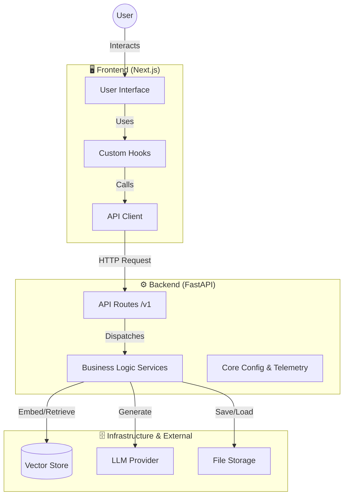
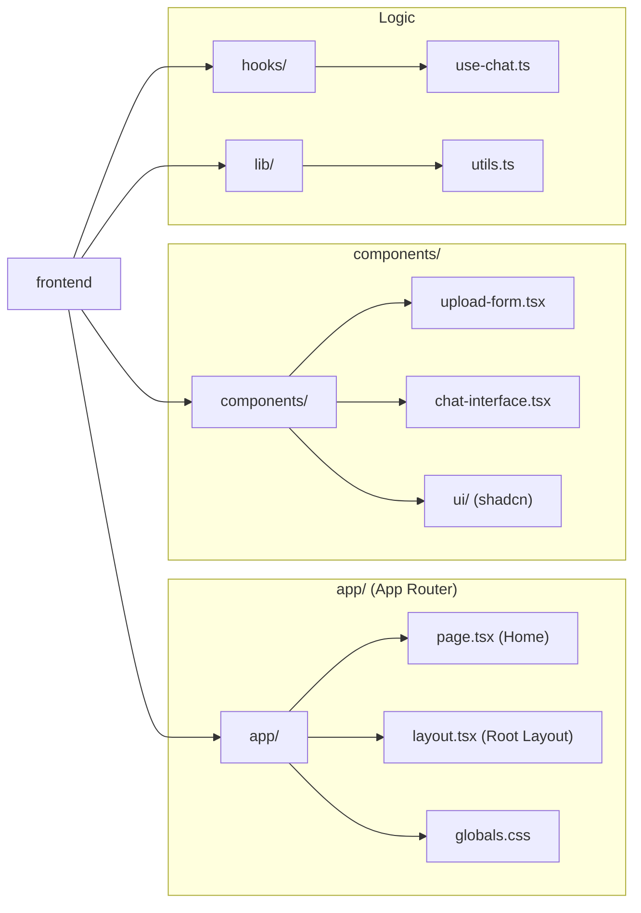
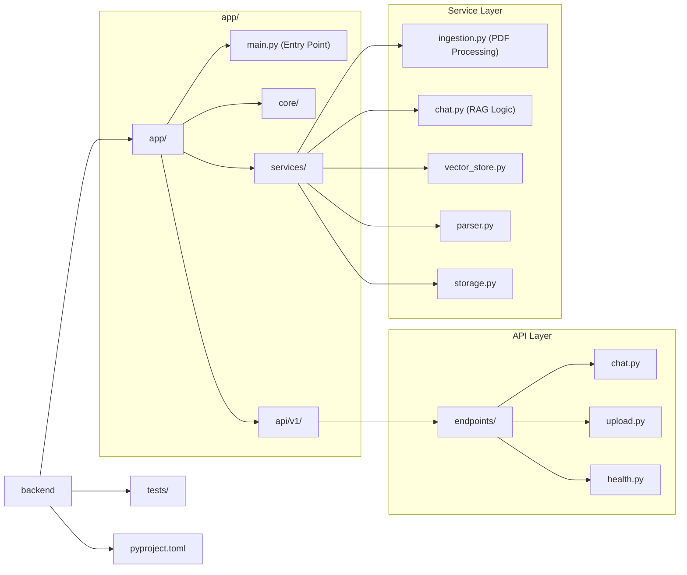
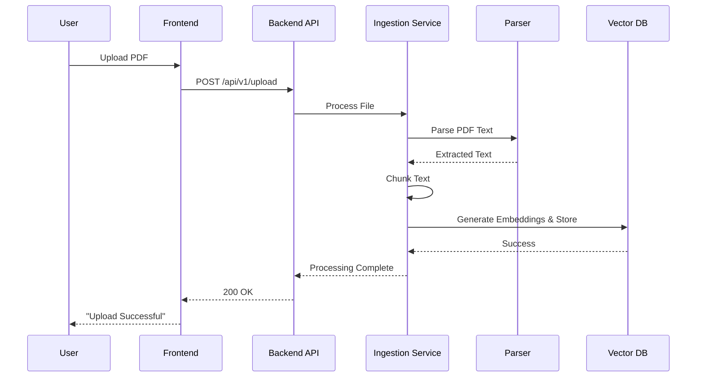
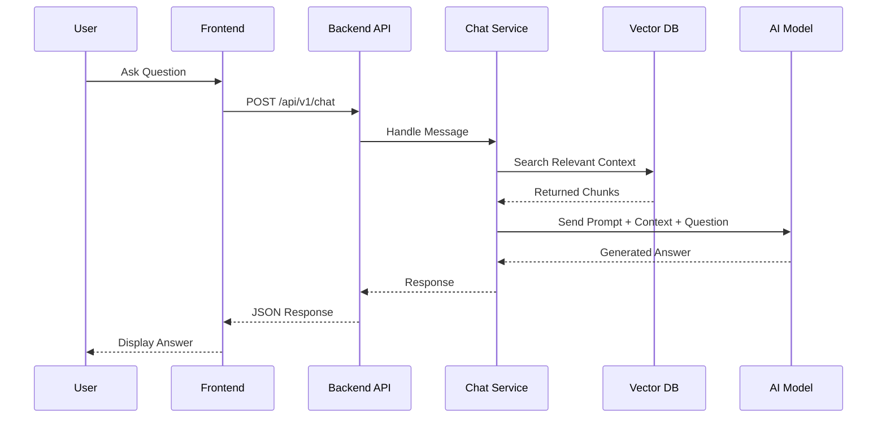

# 🗺️ RAG_PDF Code Map

This document provides a visual overview of the project structure, architecture, and data flow for the **RAG_PDF** application.

## 🏗️ Architecture Overview

The application follows a modern **Client-Server** architecture with a **Next.js** frontend and a **FastAPI** backend, designed for RAG (Retrieval-Augmented Generation) workflows.

---

## 📂 Directory Structure

### 🖥️ Frontend (`/frontend`)

**Stack:** Next.js 16 (App Router), React 19, Tailwind CSS

### ⚙️ Backend (`/backend`)

**Stack:** Python 3.11+, FastAPI, Poetry

---

## 🔄 Key Workflows

### 1. PDF Ingestion Flow

How a PDF file is uploaded and processed for search.

### 2. RAG Chat Flow

How the user asks a question and gets an answer based on the PDF.

---

## 🛠️ Tech Stack Details

| Component              | Technology              | Purpose                                       |
| :--------------------- | :---------------------- | :-------------------------------------------- |
| **Frontend Framework** | Next.js 16 (App Router) | Server-side rendering, routing, API handling. |
| **UI Library**         | React 19                | Component-based UI construction.              |
| **Styling**            | Tailwind CSS            | Utility-first CSS framework.                  |
| **Backend Framework**  | FastAPI                 | High-performance Python API framework.        |
| **Package Manager**    | Poetry                  | Python dependency management.                 |
| **Linting/Formatting** | Biome (FE) / Ruff (BE)  | Code quality and consistency.                 |
