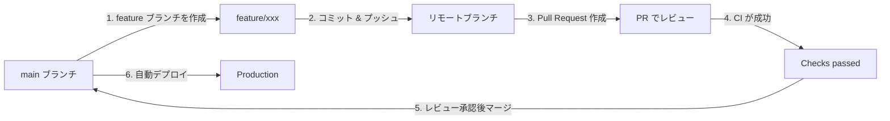

# GitHub Flow 運用ガイド

このプロジェクトでは **GitHub Flow** を採用しています。

## GitHub Flow とは

GitHub Flow はシンプルで軽量なブランチ戦略です：



## 開発フロー

### 1. ブランチを作成

新しい機能やバグ修正を行う際は、`main` から新しいブランチを作成します。

```bash
git checkout main
git pull origin main
git checkout -b feature/your-feature-name
```

**ブランチ命名規則:**

| プレフィックス | 用途                   | 例                          |
| :------------- | :--------------------- | :-------------------------- |
| `feature/`     | 新機能の追加           | `feature/add-user-profile`  |
| `fix/`         | バグ修正               | `fix/login-error`           |
| `docs/`        | ドキュメントのみの変更 | `docs/update-readme`        |
| `refactor/`    | リファクタリング       | `refactor/simplify-auth`    |
| `test/`        | テストの追加・修正     | `test/add-upload-tests`     |
| `chore/`       | ビルド・設定変更       | `chore/update-dependencies` |

### 2. コミット

変更をコミットします。コミットメッセージは [Conventional Commits](https://www.conventionalcommits.org/) に従います。

```bash
git add .
git commit -m "feat: add user profile page"
```

**コミットメッセージ形式:**

```
<type>: <subject>

[optional body]

[optional footer]
```

**Type の種類:**

- `feat`: 新機能
- `fix`: バグ修正
- `docs`: ドキュメント変更
- `style`: コードフォーマット（動作に影響なし）
- `refactor`: リファクタリング
- `test`: テスト追加・修正
- `chore`: ビルド、設定変更

### 3. プッシュ

リモートにプッシュします。

```bash
git push origin feature/your-feature-name
```

### 4. Pull Request (PR) を作成

GitHub でプルリクエストを作成します。

- **タイトル**: 簡潔で分かりやすく（例: `feat: ユーザープロフィール機能の追加`）
- **説明**: PR テンプレートに従って記入
- **レビュアー**: 適切なレビュアーを指定

### 5. CI の確認

PR を作成すると、自動的に CI が実行されます：

- ✅ Frontend: Lint → Test → Build
- ✅ Backend: Test (pytest)

すべてのチェックが通過するまで、マージはできません。

### 6. レビュー

レビュアーがコードをレビューします。修正が必要な場合は、同じブランチにコミットを追加します。

```bash
# フィードバックに対応
git add .
git commit -m "fix: address review comments"
git push origin feature/your-feature-name
```

### 7. マージ

レビュー承認後、**Squash and Merge** で `main` にマージします。

マージ後、feature ブランチは削除してください。

```bash
git checkout main
git pull origin main
git branch -d feature/your-feature-name
```

## ローカル開発

### Frontend

```bash
cd frontend
npm install
npm run dev     # 開発サーバー起動
npm run test    # テスト実行
npm run lint    # Lint チェック
npm run build   # ビルド確認
```

### Backend

```bash
cd backend
poetry install
poetry run uvicorn app.main:app --reload  # 開発サーバー起動
poetry run pytest                          # テスト実行
```

## ヒント

- **小さく頻繁にコミット**: 大きな変更は複数の PR に分割しましょう
- **main を常に最新に**: 作業開始前に必ず `git pull origin main`
- **Draft PR**: 作業中の場合は Draft PR として作成
- **WIP コミット**: 途中経過は `WIP: work in progress` などのプレフィックスを使用

## トラブルシューティング

### CI が失敗する場合

```bash
# ローカルで確認
npm run lint    # Frontend
npm run test    # Frontend
poetry run pytest  # Backend
```

### コンフリクトが発生した場合

```bash
git checkout feature/your-feature-name
git pull origin main
# コンフリクトを解消
git add .
git commit -m "fix: resolve merge conflicts"
git push origin feature/your-feature-name
```
